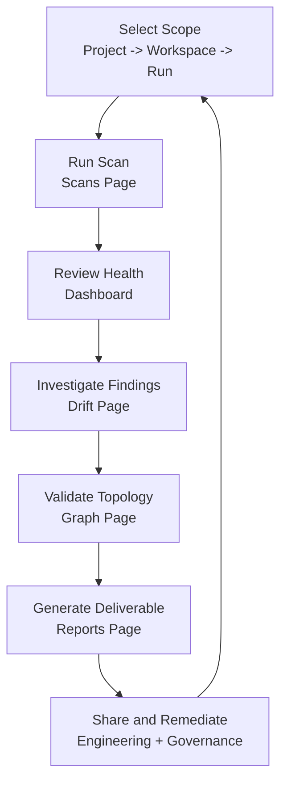

# Architecture Drift Copilot

An AI-powered tool for detecting and analyzing drift between intended architecture, Terraform state, and deployed AWS infrastructure.

> **Current status:** The application is **mock-backed** today — all screens and features are fully functional using pre-generated mock data. Real agent implementations (live AWS/Terraform/LLM) are in progress; see `STATUS.md`.

## Operating Modes

The app runs in one of two modes, set by the backend `DEMO_MODE` environment variable. **Both modes expose the same UI and the same full feature set** — only the data source changes.

| | Mock Mode (`DEMO_MODE=true`, default) | Live Mode (`DEMO_MODE=false`) |
|---|---|---|
| **Data source** | Pre-generated mock data **only** | Real `architecture.yaml`, `terraform show -json`, AWS read-only SDK |
| **External calls** | None (no AWS, no LLM, no Terraform CLI) | AWS read-only APIs + optional Anthropic API |
| **Reasoning** | Deterministic templates | Anthropic API when key set, else deterministic |
| **Functionality** | **Everything visible and working** | Identical feature set |
| **Fallbacks** | n/a | Auto mock-inventory fallback when no AWS creds |

In **mock mode**, no feature is hidden, disabled, or stubbed — dashboard, findings, graph, reports, filtering, and download all work without any credentials or API keys.

## 🚀 Quick Start

### Prerequisites

- Node.js 18+ and npm/pnpm
- (Optional) AWS credentials for real inventory scanning
- (Optional) Anthropic API key for AI-powered reasoning

### Installation

```bash
# Clone the repository
git clone <repository-url>
cd artifact-drift

# Install dependencies
npm install

# Or using pnpm
pnpm install
```

### Running in Mock Mode (Demo)

The easiest way to get started is mock mode, which uses pre-generated mock data only — no AWS credentials or API keys required, and every feature is fully functional:

```bash
# Terminal 1: Start backend in demo mode
cd backend
echo "DEMO_MODE=true" > .env
npm run dev

# Terminal 2: Start frontend
cd frontend
npm run dev
```

Open your browser to `http://localhost:5174` (or the port shown in the terminal).

### Running with Real Data

To analyze real infrastructure:

1. **Configure AWS credentials** (standard AWS credential chain)
2. **Add Anthropic API key** (optional, for AI reasoning):
   ```bash
   cd backend
   echo "DEMO_MODE=false" > .env
   echo "ANTHROPIC_API_KEY=your-key-here" >> .env
   ```
3. **Test LLM connectivity** (recommended before running scans):
  ```bash
  cd backend
  set -a && source .env && set +a
  BASE_URL="${ANTHROPIC_BASE_URL:-https://api.anthropic.com}"
  curl -sS "$BASE_URL/v1/messages" \
    -H "x-api-key: $ANTHROPIC_API_KEY" \
    -H "anthropic-version: 2023-06-01" \
    -H "content-type: application/json" \
    -d '{"model":"claude-sonnet-4-6","max_tokens":16,"messages":[{"role":"user","content":"reply with ok"}]}'
  ```
  A successful response includes a JSON message payload from the model.
4. **Prepare your architecture files**:
   - `examples/architecture.yaml` - Your intended architecture
   - `examples/terraform-state.json` - Export from `terraform show -json`
   - Or let the tool fetch AWS inventory automatically

5. **Start the servers** (same as demo mode, but with `DEMO_MODE=false`)

## 🎬 Demo Script

A suggested 7-step walkthrough for demos (works end to end in mock mode):

1. **Show the approved architecture.** Open `examples/architecture.yaml` and describe the intended design (VPC, subnets, security groups, EC2, ALB, tags).
2. **Show the Terraform state.** Open `examples/terraform-state.json` — what Terraform believes it manages.
3. **Show the AWS runtime.** Open `examples/aws-mock-inventory.json` — what is actually deployed.
4. **Run the analysis.** Open the Scans page and run a scan for the selected workspace. The compliance score and statistics populate immediately.
5. **Show Terraform and AWS diverging from the approved design.** Walk the Findings list and Graph view (Planned / Terraform / Deployed) to highlight the 8 drift types — e.g. a missing subnet, an unmanaged `debug-sg`, SSH opened outside Terraform on `web-sg`, and instance-type mismatch on `web-server`.
6. **Generate a report.** Open the Reports page, select HTML or JSON, preview, and download. (A pre-generated sample lives at `examples/example-report.html` and `examples/example-report.json`.)
7. **Explain future integrations.** Note the placeholder connectors for Confluence, HCP Terraform, AWS, and Slack, and how live mode swaps mock data for real sources without changing the UI.

## 👤 Using Drifters (User Guide)

This section describes how a platform engineer, security reviewer, or application owner uses Drifters in daily operations.

### Typical User Workflow

1. Select **Project**, **Workspace**, and optional **Run** from the global top bar.
2. Go to **Scans** and run analysis for the selected workspace.
3. Open **Dashboard** to review compliance score, drift totals, and trend signals for the selected scope.
4. Open **Drift** to investigate findings, apply filters, and track status (acknowledged, resolved, suppressed).
5. Open **Graph** to compare Planned, Terraform, and Deployed views and visually confirm drift patterns.
6. Open **Reports** to generate an executive or audit-friendly report (HTML/PDF/JSON) for the selected run.
7. Share the report with engineering and governance stakeholders, then iterate on remediation.



### What Each Page Is For

- **Dashboard**: quick health snapshot for the selected scope (score, severity, project posture).
- **Projects**: manage workspace-level configuration and source integrations.
- **Scans**: execute analyses and view run history.
- **Graph**: inspect architecture shape and relationships across layers.
- **Drift**: triage individual findings and operational status.
- **Reports**: create downloadable evidence packages for stakeholders.

### Fast Path For New Users

1. Start in mock mode.
2. Pick a project/workspace from the global selectors.
3. Run one scan from **Scans**.
4. Review **Dashboard** and **Drift**.
5. Export a PDF report from **Reports**.

## 📋 Features

### ✨ Core Capabilities

- **Multi-Source Analysis**: Compare architecture intent, Terraform state, and AWS reality
- **8 Drift Types Detected**:
  - MISSING - Resources in intent/Terraform but not in AWS
  - UNMANAGED - Resources in AWS but not in Terraform
  - CHANGED_OUTSIDE_TERRAFORM - Manual changes to Terraform-managed resources
  - ATTRIBUTE_MISMATCH - Configuration differences between sources
  - TAG_MISMATCH - Missing or incorrect tags
  - CONFIGURATION_DRIFT - Complex configuration differences
  - RELATIONSHIP_BROKEN - Broken resource relationships
  - VERSION_MISMATCH - Version inconsistencies

- **AI-Powered Reasoning**: LLM analysis of each drift finding with:
  - Root cause analysis
  - Impact assessment
  - Terraform remediation code
  - Deterministic fallback when API unavailable

- **Interactive Visualizations**:
  - Dashboard with compliance score and statistics
  - Filterable findings list with detailed views
  - Graph visualization across three views (Planned/Terraform/Deployed)
  - Exportable reports (HTML/JSON)

### 🔒 Security Features

- **Automatic Redaction**: Sensitive data (passwords, keys, connection strings) automatically redacted
- **Whitelisted LLM Input**: Only safe, pre-approved fields sent to AI
- **No Credential Storage**: AWS credentials never stored or logged

## 📊 Dashboard

The dashboard provides:
- **Compliance Score**: Overall drift health (0-100)
- **Statistics**: Findings by severity and type
- **Charts**: Visual breakdown of drift patterns
- **Recent Findings**: Quick access to latest issues

## 🔍 Findings View

Detailed findings with:
- **Filtering**: By severity, type, and search
- **Expandable Details**: Click to see full analysis
- **AI Reasoning**: Root cause, impact, and remediation
- **Side-by-Side Comparison**: Expected vs observed values

## 🗺️ Graph View

Interactive architecture visualization:
- **Three Views**: Switch between Planned, Terraform, and Deployed
- **Visual Drift Indicators**: Color-coded nodes show drift
- **Relationships**: See connections between resources
- **Zoom & Pan**: Navigate large architectures

## 📄 Reports

Generate comprehensive reports:
- **HTML Format**: Human-readable with styling
- **JSON Format**: Machine-readable for automation
- **Includes**: All findings, reasoning, and remediation steps
- **Download**: Save for compliance or sharing

## 🏗️ Architecture

### Backend (`/backend`)

- **Express.js** API server
- **Drizzle ORM** with SQLite for data persistence
- **TypeScript** for type safety
- **Agents**:
  - DesignIntentAgent - Parses architecture YAML
  - TerraformStateAgent - Reads Terraform state with redaction
  - AWSInventoryAgent - Fetches AWS resources (with mock fallback)
  - DriftAnalysisAgent - Detects all drift types
  - ReasoningAgent - AI-powered analysis with deterministic fallback

### Frontend (`/frontend`)

- **React 18** with TypeScript
- **Vite** for fast development
- **TailwindCSS** for styling
- **React Query** for data fetching
- **React Flow** for graph visualization
- **Recharts** for statistics charts

## 🧪 Development

### Project Structure

```
artifact-drift/
├── backend/
│   ├── src/
│   │   ├── api/          # API routes
│   │   ├── db/           # Database schema and seed
│   │   ├── services/     # Business logic
│   │   ├── types/        # TypeScript types
│   │   └── server.ts     # Express app
│   └── data/
│       └── mock/         # Mock data for demo mode
├── frontend/
│   ├── src/
│   │   ├── components/   # Reusable UI components
│   │   ├── pages/        # Page components
│   │   ├── lib/          # Utilities and API client
│   │   └── App.tsx       # Main app component
│   └── public/
├── examples/             # Sample architecture files
└── docs/                 # Documentation
```

### Available Scripts

**Backend:**
```bash
npm run dev      # Start development server
npm run build    # Build for production
npm run start    # Start production server
```

**Frontend:**
```bash
npm run dev      # Start development server
npm run build    # Build for production
npm run preview  # Preview production build
```

### Environment Variables

**Backend (.env):**
```bash
PORT=3001                          # API server port
DEMO_MODE=true                     # Use mock data (true/false)
ANTHROPIC_API_KEY=sk-ant-...      # Optional: For AI reasoning
```

**Frontend (.env):**
```bash
VITE_API_URL=http://localhost:3001/api  # Backend API URL
```

## 📖 Usage Examples

### Running Your First Scan

1. Start the application in demo mode
2. Click "Run Scan" on the dashboard
3. View results in real-time
4. Explore findings and remediation steps

### Analyzing Real Infrastructure

1. Export your Terraform state:
   ```bash
   terraform show -json > examples/terraform-state.json
   ```

2. Create your architecture intent file (`examples/architecture.yaml`)

3. Configure AWS credentials

4. Set `DEMO_MODE=false` and restart backend

5. Run scan and analyze results

## 🔧 Configuration

### Architecture YAML Format

```yaml
version: "1.0"
metadata:
  name: "my-infrastructure"
  region: "us-east-1"

resources:
  - type: vpc
    logical_name: main-vpc
    attributes:
      cidr_block: "10.0.0.0/16"
    tags:
      Environment: production
      ManagedBy: terraform
```

See `examples/architecture.yaml` for a complete example.

## 🐛 Troubleshooting

### Backend won't start
- Check if port 3001 is available
- Verify Node.js version (18+)
- Check `.env` file exists with `DEMO_MODE=true`

### Frontend shows connection errors
- Ensure backend is running on port 3001
- Check CORS settings if using different ports
- Verify `VITE_API_URL` in frontend `.env`

### No findings detected
- Verify mock data files exist in `backend/data/mock/`
- Check database was seeded (delete `artifact-drift.db` and restart)
- Review backend logs for errors

### Graph not rendering
- Check browser console for errors
- Ensure React Flow CSS is loaded
- Verify graph data is being fetched (Network tab)

## 🤝 Contributing

Contributions are welcome! Please:

1. Fork the repository
2. Create a feature branch
3. Make your changes
4. Add tests if applicable
5. Submit a pull request

## 📝 License

See LICENSE file for details.

## 🙏 Acknowledgments

- Built with [React](https://react.dev/)
- Powered by [Anthropic Claude](https://www.anthropic.com/)
- Visualizations by [React Flow](https://reactflow.dev/)
- Charts by [Recharts](https://recharts.org/)

## 📞 Support

For issues and questions:
- Open an issue on GitHub
- Check the documentation in `/docs`
- Review example files in `/examples`

## 🚀 Future Enhancements

The following roadmap ideas focus on improving enterprise readiness, automation depth, and AI-assisted operations.

| Enhancement | Description | AI Role | Priority |
|---|---|---|---|
| Integration Scope Filtering by Domain | Add capability to restrict each integration/diagram scope (for example, only Network or only Kubernetes resources). | Use NLP prompts + resource classification to map user intent to filtered graph views and findings subsets. | High |
| AI-Enhanced Diagram and Integration Logic | Improve parsing, normalization, and reconciliation for architecture diagrams and external integrations. | Use model-assisted entity extraction, relationship inference, and confidence scoring for graph construction. | High |
| Automated Test Enforcement on Commit | Add enhanced test capabilities that run automated checks for every git commit. | Use AI-generated test cases, edge-case suggestions, and flaky-test detection to strengthen pre-commit coverage. | High |
| Production Readiness + CI/CD | Prepare app for production deployment with documented requirements and full CI/CD pipelines. | Use AI to generate environment baselines, deployment manifests, policy checks, and release notes. | High |
| Expanded Integrations | Add more integration capabilities (for example Confluence, Vault, Terraform Enterprise). | Use AI adapters to normalize heterogeneous APIs into a common resource/graph schema. | High |
| Notifications and Alerting | Add notification capabilities (for example email and Slack) for drift events and policy violations. | Use AI summarization to produce role-specific, actionable alert messages with remediation context. | Medium |
| Drift Issue Reporting | Add native actions to open GitHub Issues or Jira tickets from drift findings. | Use AI to auto-draft issue titles, severity labels, acceptance criteria, and fix guidance. | Medium |
| AI Remediation Planner | Generate phased remediation plans grouped by risk, blast radius, and dependency order. | Build AI planning that proposes safe change sequences with rollback hints. | Medium |
| Predictive Drift Risk Scoring | Predict likely future drift hotspots before violations happen. | Train AI models on historical scans to identify high-risk services and misconfiguration trends. | Medium |
| Policy Authoring Assistant | Help teams create and refine governance policies from plain-language requirements. | Convert natural-language controls into enforceable policy templates and validation tests. | Medium |
| AI Change Impact Simulation | Simulate the likely impact of Terraform or architecture changes before deployment. | Use AI what-if analysis against graph dependencies to estimate affected resources and drift risk. | Medium |
| Executive Insights and Natural Language Q&A | Add chat-style Q&A for leadership and auditors to query drift posture quickly. | Use AI summarization and retrieval to answer questions from findings, scores, and reports. | Low |
| Multi-Cloud and Platform Expansion | Extend support to Azure, GCP, and Kubernetes-native platforms. | Use AI normalization to align cloud-specific metadata to unified drift categories. | Low |

Roadmap sequencing can be adjusted based on user feedback, compliance priorities, and operational maturity goals.

---

**Made with ❤️ for better infrastructure management**
